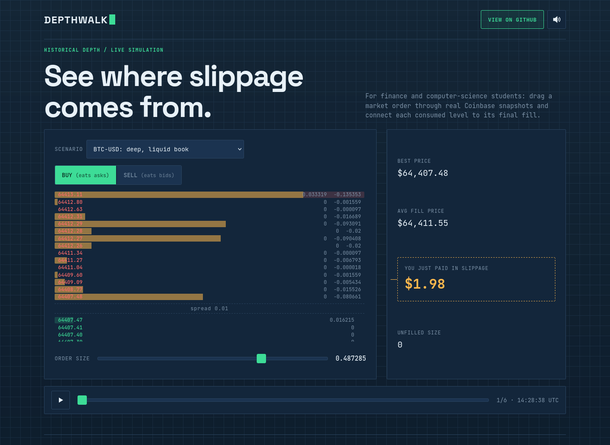

# Depthwalk

**▶ Live demo: [apps.charliekrug.com/order-flow](https://apps.charliekrug.com/order-flow/)**

[](https://github.com/ctkrug/order-flow/actions/workflows/ci.yml)
[](LICENSE)

**Watch market orders turn depth into slippage.**

Depthwalk is a browser lab for finance and computer-science students learning
market microstructure. Drag a market order through historical Coinbase L2
snapshots and watch each fill change the average price and dollar slippage.
There is no account, backend, or trading connection.



## Try an experiment

1. Open the [live simulator](https://apps.charliekrug.com/order-flow/).
2. Choose **BTC-USD: deep, liquid book** and drag **Order size** until the
   amber slippage counter first moves above zero.
3. Scrub the six-snapshot timeline. The slider keeps its relative position
   while the available depth changes.
4. Choose **AUCTION-USD: thin, low-liquidity book** and repeat the order.
   Compare the consumed levels, average fill price, and unfilled size.
5. Switch from **Buy** to **Sell** to walk the bid side instead of the asks.

The colored depth bars show liquidity that remains at each price. Amber bars
show the portion consumed by the simulated order. The fill statistics update
together so the path through the book stays connected to the final cost.

## What it demonstrates

- **A quote is not a fill.** Increase size past the top level and see the order
  accept worse prices deeper in the ladder.
- **Liquidity changes the result.** Replay two real markets and six timestamps
  per market with the same matching logic.
- **Slippage has a dollar value.** Best price, volume-weighted average price,
  unfilled size, and slippage cost update on every slider input.
- **The simulation is inspectable.** Rust computes fills in WebAssembly while
  D3 renders the returned levels; the browser never submits an order.

For a buy, the engine reports slippage as
`(average fill price - best ask) × filled size`. For a sell, it mirrors the
calculation against the best bid. Invalid levels and non-positive order sizes
are ignored without poisoning the result.

## Run locally

Requirements:

- Node.js 20.19 or newer
- A current Rust toolchain with the `wasm32-unknown-unknown` target
- `wasm-bindgen-cli` 0.2.126

```sh
rustup target add wasm32-unknown-unknown
cargo install wasm-bindgen-cli --version 0.2.126 --locked

cd site
npm ci
npm run dev
```

The `predev` hook compiles `engine/` to WebAssembly and generates local
bindings in `site/vendor/engine/`. Vite then prints the development URL.

## Test and build

```sh
cd engine
cargo fmt --check
cargo clippy --all-targets -- -D warnings
cargo test
cargo build --release --target wasm32-unknown-unknown

cd ../site
npm test
npm run test:coverage
npm run test:e2e
npm run build
```

The test matrix covers native Rust fills, core browser logic with an 85% line
floor, Firefox end-to-end replay and recovery flows, the WASM target, and the
subpath-relative production build. Static output lands in `site/dist/`.

## Project map

```text
engine/               Rust matching engine and WASM entry point
site/js/               D3 view, replay state, audio, and pure UI modules
site/public/data/      Bundled Coinbase L2 snapshots and provenance
site/e2e/              Firefox interaction and recovery checks
docs/                  Positioning, design, architecture, and launch notes
```

Start with [the architecture map](docs/ARCHITECTURE.md) for the data flow and
[the design direction](docs/DESIGN.md) for the blueprint tokens and interaction
rules. The snapshot [data notes](site/public/data/README.md) identify the public
Coinbase endpoint, products, timestamps, and ordering assumptions.

## Scope and license

Depthwalk is an educational replay tool, not an execution venue, live-data
terminal, price forecast, or trading recommendation. It is released under the
[MIT License](LICENSE).

More of Charlie's projects: [apps.charliekrug.com](https://apps.charliekrug.com)
